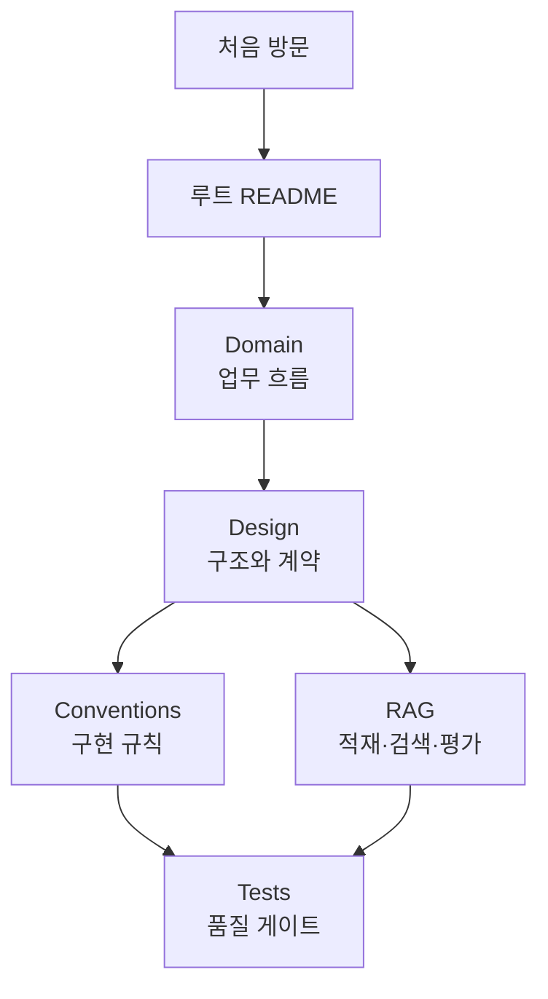

# FinAgent-SME 문서 허브

이 디렉터리는 코드에 구현된 계약과 동작을 설명하는 문서의 진입점입니다. 처음 보는 사람은 **제품 흐름 → 설계 → API → 개발 규칙** 순서로 읽는 것이 가장 빠릅니다.

## 읽기 경로

| 독자 | 추천 문서 | 얻을 수 있는 정보 |
| --- | --- | --- |
| 심사·기획 담당자 | [유스케이스](design/use-case-specification.md), [워크플로우](domain/workflows.md) | 사용자 흐름, 결과와 예외 시나리오 |
| 백엔드 개발자 | [컴포넌트](design/component-design.md), [인터페이스](design/interface-definition.md) | 모듈 책임, API와 내부 contract |
| 데이터 개발자 | [ERD](design/erd.md), [산업 RAG](rag/industry-methodology.md) | 저장 모델, 벡터 적재와 평가 |
| 리뷰어 | [에러 처리](conventions/error-handling.md), [테스트](conventions/testing.md) | 실패 규칙과 병합 전 검증 |

## 문서 지도

### Domain

- [Credit Assessment Workflow](domain/workflows.md): agent 의존성과 전체 상태 계산

### Design

- [컴포넌트 설계](design/component-design.md): 런타임과 계층별 책임
- [시퀀스 다이어그램](design/sequence-diagram.md): 비동기 job, fallback, DB 구축 흐름
- [인터페이스 정의](design/interface-definition.md): HTTP, agent, provider, service 계약
- [ERD](design/erd.md): 업무 데이터와 `workflow_jobs`
- [유스케이스 명세](design/use-case-specification.md): 사용자·운영자 관점의 정상/대체 흐름

### RAG

- [산업 방법론 RAG](rag/industry-methodology.md): PDF 적재, Chroma 검색, retriever/agent RAGAS 평가

### Conventions

- [네이밍](conventions/naming.md)
- [에러 처리](conventions/error-handling.md)
- [테스트](conventions/testing.md)
- [Agent 실행 계약](conventions/agent-execution-contract.md)

## 문서 유지 원칙

1. 현재 구현과 공개 계약을 기준으로 작성합니다.
2. 아직 노출되지 않은 기능은 `현재 한계` 또는 `확장 포인트`로 구분합니다.
3. 구조와 상태 전이는 Mermaid, 필드 계약은 표, 재현 절차는 실행 가능한 명령으로 표현합니다.
4. API 변경 시 인터페이스와 시퀀스 문서를, DB 변경 시 ERD를, agent 변경 시 워크플로우와 해당 agent README를 함께 갱신합니다.
