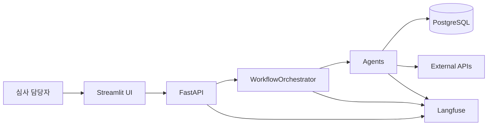

# 컴포넌트 설계서

## 1. 문서 개요

- 목적: 현재 구현된 FinAgent-SME 컴포넌트와 책임을 설명한다
- 원칙:
  - API는 얇게 유지한다
  - 오케스트레이터가 흐름을 제어한다
  - agent는 단일 책임에 가깝게 유지한다
  - 공통 메타데이터는 contract로 표준화한다

## 2. 상위 아키텍처

## 3. 컴포넌트 목록

| 계층 | 컴포넌트 | 책임 |
| --- | --- | --- |
| Presentation | Streamlit UI | 회사명 입력, 결과 렌더링 |
| API | FastAPI Router | 요청 검증, request_id 바인딩, HTTP 매핑 |
| Orchestration | `WorkflowOrchestrator` | 그래프 실행, 상태 계산, 응답 조립 |
| Agent | `CompanyResolverAgent` | 기업 식별 |
| Agent | `NewsCollectorAgent` | 뉴스 수집/요약/적재 |
| Agent | `FinancialAnalystAgent` | 재무 분석 |
| Agent | `IndustryAnalystAgent` | 산업/거시 분석 |
| Agent | `RiskEventAgent` | 이벤트 탐지 |
| Agent | `DecisionAgent` | 등급/판단/한도 산출 |
| Agent | `ReportAgent` | 보고서 생성 |
| Agent | `ValidationAgent` | 결과 검증과 score 기록 |
| Data | Repository / Service | DB 조회/저장, use-case 처리 |
| Observability | Logging / Langfuse | 요청 추적과 품질 score |

## 4. 오케스트레이터 설계

### 역할

- payload를 초기 context로 변환
- agent 프로토콜 검증
- LangGraph 노드/엣지 구성
- step 결과를 공통 형식으로 기록
- 최종 `context`와 `steps`를 반환

### 그래프 규칙

| 구분 | 노드 |
| --- | --- |
| Resolver | `company_resolver` |
| 시작 노드 | `news_collector`, `financial_analyst` |
| 의존 노드 | `risk_event`, `industry_analyst` |
| 후속 노드 | `decision`, `report`, `validation` |

### 상태 계산

- `build_result()`가 최종 응답을 조립한다
- 기업 미존재 시 `not_target`
- 나머지는 `steps[*].ok` 집계로 `success/partial/failed`

## 5. 주요 agent 설계

### `CompanyResolverAgent`

- 입력: `company_name`
- 의존성: `company_lookup` service
- 출력: `company_found`, `corp_code`, `corp_name`, `company_profile`

### `NewsCollectorAgent`

- 입력: 기업 식별 정보, 옵션성 수집 파라미터
- 의존성: `backend/tools/news.py`
- 출력: `news_result`, `news_data`, `news_tool_runs`, `news_tool_errors`

### `FinancialAnalystAgent`

- 입력: `corp_code`, 선택적 `target_year`
- 의존성: `FinancialDataProvider`
- 출력: `financial_statements`, `financial_ratios`, `financial_trend`, `grade_cap`

### `IndustryAnalystAgent`

- 입력: `corp_code`, `financial_ratios`
- 의존성: `IndustryDataProvider`
- 출력: `industry_summary`, `industry_outlook`, `business_cycle`, `macro_indicators`

### `RiskEventAgent`

- 입력: `news_data`, `corp_code`, `company_name`
- 출력: `overall_risk_level`, 이벤트 카운트, 처리 오류 정보

### `DecisionAgent`

- 입력: 리스크/재무/산업 context
- 출력: `decision`, `credit_grade`, `credit_score`, `recommended_limit`, `explanation`

### `ReportAgent`

- 입력: 판단 결과와 explanation
- 출력: `report`
- 특이사항: explanation 부족 시 fallback summary/recommendation 생성

### `ValidationAgent`

- 입력: `decision`, `credit_grade`, `recommended_limit`, `report`
- 출력: `validation_result`
- 특이사항: Langfuse score는 활성화된 경우만 기록

## 6. 데이터 계층

| 계층 | 역할 |
| --- | --- |
| `backend/data/db.py` | DB URL 해석, 테이블명 상수 |
| `repositories/` | SQL 조회, DataFrame append/save |
| `services/` | 기업 조회, DART 파이프라인 orchestration |

## 7. 관측성

| 수단 | 위치 | 목적 |
| --- | --- | --- |
| 구조화 로깅 | API, orchestrator, agent | 운영 추적 |
| Langfuse trace | workflow root | 요청 단위 추적 |
| Langfuse observation | agent/tool | 세부 실행 가시성 |
| Langfuse score | validation | 품질 수치 기록 |
| `steps` | API 응답 | step 수준 디버깅 정보 제공 |

## 8. 실행 구성

| 구성요소 | 현재 방식 |
| --- | --- |
| Backend | `uvicorn backend.main:app` |
| Frontend | Streamlit |
| DB | `backend/docker-compose.yml`의 PostgreSQL |
| DB Build | `scripts/setup-db.sh build` |

## 9. 현재 확장 포인트

- 공개 API body 확장 (`pdf_path`, `continue_on_error` 등)
- 추가 agent 노드 연결
- UI 업로드/진행상태 기능
- 운영성 테이블(`workflow_runs` 등) 추가
