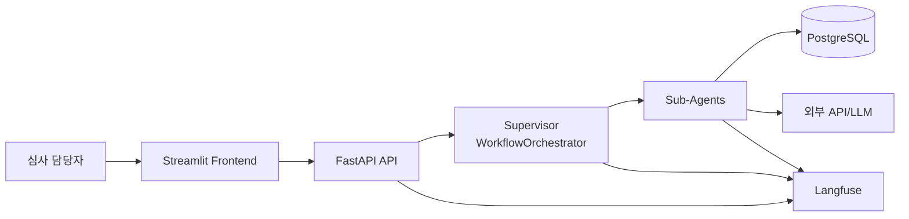

# 컴포넌트 설계서

## 1. 문서 개요

- 문서 목적: FinAgent-SME의 논리 컴포넌트와 책임, 상호작용, 배치 구성을 정의한다.
- 설계 원칙:
  - Supervisor가 전체 흐름을 제어한다.
  - Sub-Agent는 단일 책임 원칙에 따라 역할을 분리한다.
  - 외부 데이터 접근은 service/repository/provider 계층을 통해 수행한다.
  - 오류는 표준 contract로 정규화해 downstream에 전달한다.

## 2. 상위 아키텍처

## 3. 컴포넌트 목록

| 계층 | 컴포넌트 | 책임 |
| --- | --- | --- |
| Presentation | Streamlit Frontend | 회사명 입력, 헬스 체크, 결과 표시 |
| API | FastAPI Router | 입력 검증, request_id 바인딩, HTTP 응답 매핑 |
| Orchestration | `WorkflowOrchestrator`, `WorkflowGraphBuilder` | Supervisor 역할, Agent 실행 순서/분기/병합 관리 |
| Agent | `CompanyResolverAgent` | 대상 기업 여부 확인 |
| Agent | `NewsCollectorAgent` | 뉴스 수집, 요약, 적재, downstream 뉴스 컨텍스트 생성 |
| Agent | `FinancialAnalystAgent` | 재무제표/비율/추세/grade cap 분석 |
| Agent | `IndustryAnalystAgent` | 업종 매핑, 산업 평균, 업황/거시 분석 |
| Agent | `RiskEventAgent` | 뉴스/공시/법적/재무 이상 징후 통합 |
| Agent | `DecisionAgent` | 신용등급, 승인 판단, 한도 추천, 설명 생성 |
| Agent | `ReportAgent` | 최종 리포트 생성 |
| Agent | `MultiModalDocumentAgent` | PDF/문서 분석 |
| Domain Service | `company_lookup`, `company_registry_pipeline` | 유스케이스 수준 데이터 처리 |
| Repository | `company_master`, `financial_feature`, `company_registry` | DB 조회/저장 |
| Tool/Provider | `financial.py`, `industry.py`, `news.py`, provider classes | 외부 데이터/분석 로직 제공 |
| Observability | Langfuse, logging | trace, span, tool 실행 추적 |

## 4. Supervisor 설계

### 4.1 역할

- 요청 단위 컨텍스트 생성
- Agent 프로토콜 검증
- 실행 그래프 빌드
- 병렬 및 의존 관계 관리
- 실패/부분성공/정상종료 상태 계산
- 최종 응답 조립

### 4.2 실행 그래프 규칙

| 단계 | 설명 |
| --- | --- |
| Resolver | `CompanyResolverAgent` 실행 후 대상 기업 여부 판별 |
| 병렬 시작 | `news_collector`, `financial_analyst`, 선택적 `multimodal_document` |
| 의존 노드 | `risk_event`는 `news_collector` 이후, `industry_analyst`는 `financial_analyst` 이후 |
| 순차 종료 | `decision` -> `report` |

## 5. Sub-Agent 설계

### 5.1 CompanyResolverAgent

- 입력: `company_name`
- 출력: `company_found`, `corp_code`, `corp_name`
- 저장소: `sme_list`
- 실패 정책: 공백 입력 시 예외, 미존재 시 `not_target`

### 5.2 NewsCollectorAgent

- 입력: `company_name`, `corp_name`, `stock_code`
- 내부 컴포넌트: `ToolNewsCollectionProvider`, `backend.tools.news`
- 출력: `news_data`, `news_result`, `news_tool_runs`, `news_tool_errors`
- 특이사항: DB 적재와 downstream 뉴스 컨텍스트를 동시에 생성

### 5.3 FinancialAnalystAgent

- 입력: `corp_code`
- 내부 컴포넌트: 재무 provider, 재무 비율/추세/리스크 필터
- 출력: `financial_statements`, `financial_ratios`, `grade_cap`
- 실패 정책: tool 단위 fallback 지원

### 5.4 IndustryAnalystAgent

- 입력: `corp_code`, `financial_ratios`
- 내부 컴포넌트: 업종 매핑, 산업 평균, 경기/거시 도구
- 출력: `industry_summary`, `peer_comparison`, `macro_indicators`

### 5.5 RiskEventAgent

- 입력: `news_data`, `disclosure_data`, `court_data`, `corp_code`
- 내부 컴포넌트: 키워드, 감성, 공시, 법적, 재무 이상 핸들러
- 출력: `overall_risk_level`, 이벤트 카운트, 타임라인, 분류 이벤트
- 특이사항: 내부 LangGraph에서 핸들러를 병렬 수행

### 5.6 DecisionAgent

- 입력: 병합된 재무/산업/리스크/문서 컨텍스트
- 내부 컴포넌트: 등급 계산, 승인 판단, 한도 추천, 설명 생성
- 출력: `decision`, `credit_grade`, `credit_score`, `recommended_limit`, `explanation`

### 5.7 ReportAgent

- 입력: Decision 결과와 주요 근거
- 출력: 최종 `report`
- 실패 정책: explanation 부족 시 summary/recommendation fallback

## 6. 데이터 계층 설계

| 계층 | 책임 |
| --- | --- |
| `backend/data/db.py` | DB 연결 정보 해석, 테이블 상수 제공 |
| Repository | SQL 실행, 테이블 존재 여부 확인, 오류 메시지 표준화 |
| Service | 비즈니스 의미 있는 조회/배치 유스케이스 제공 |

## 7. 관측성 설계

| 수단 | 적용 위치 | 목적 |
| --- | --- | --- |
| 구조화 로깅 | API, Orchestrator, Agent, Tool | 운영 추적, request_id 연동 |
| Langfuse Trace | Workflow 루트 | 요청 단위 실행 흐름 추적 |
| Langfuse Observation | Agent/Tool/LLM 호출 | 병목, fallback, generation 분석 |
| `steps` 메타데이터 | 최종 응답 | 단계별 상태와 fallback 근거 노출 |

## 8. 배포/실행 구성

| 구성요소 | 현재 방식 |
| --- | --- |
| Backend | `uvicorn backend.main:app` |
| Frontend | Streamlit |
| Database | `backend/docker-compose.yml`의 PostgreSQL |
| Batch | `scripts/setup-db.sh build` |

## 9. 확장 포인트

- Supervisor에 신규 Agent 노드 추가
- MCP/A2A 연동용 adapter 계층 추가
- Validation Agent 및 evaluation pipeline 추가
- vLLM 기반 사내/온프레미스 LLM provider 추가
