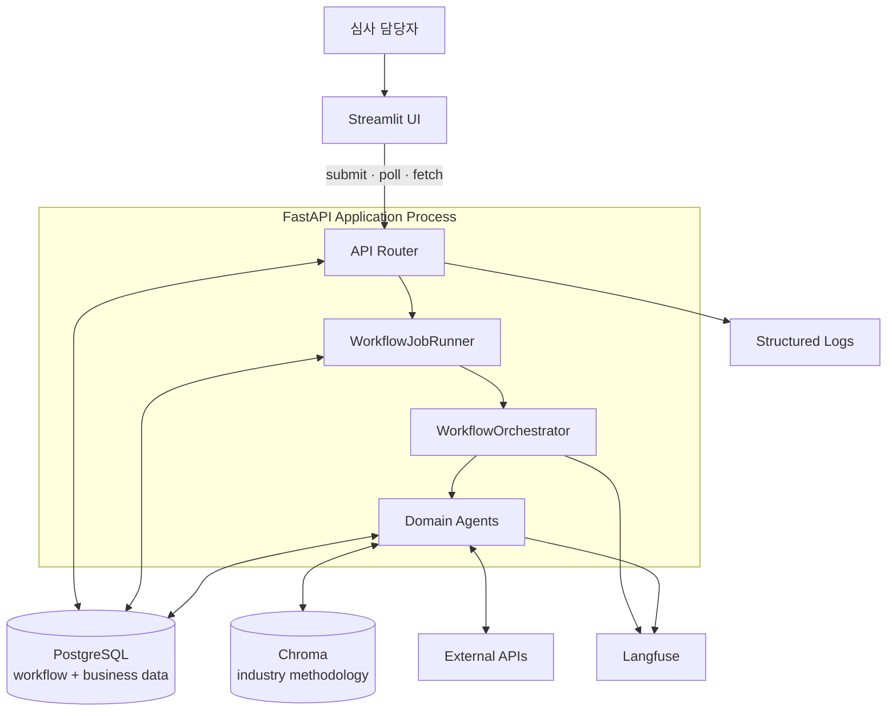
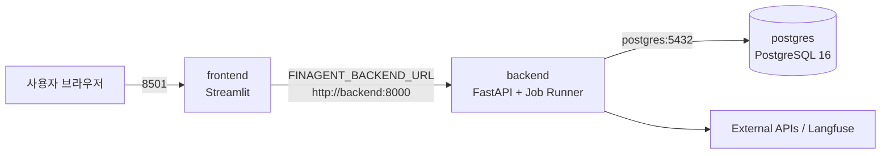

# 컴포넌트 설계서

## 1. 문서 개요

- 목적: 현재 구현된 FinAgent-SME 컴포넌트와 책임을 설명한다
- 원칙:
  - API는 얇게 유지한다
  - 오케스트레이터가 흐름을 제어한다
  - agent는 단일 책임에 가깝게 유지한다
  - 공통 메타데이터는 contract로 표준화한다

## 2. 상위 아키텍처


```mermaid
flowchart TB
    User[심사 담당자] --> UI[Streamlit UI]

    subgraph App[FastAPI Application Process]
        API[API Router]
        Runner[WorkflowJobRunner]
        ORCH[WorkflowOrchestrator]
        AGENTS[Domain Agents]
        API --> Runner
        Runner --> ORCH --> AGENTS
    end

    UI -->|submit · poll · fetch| API
    API <--> DATA[(PostgreSQL\nworkflow + business data)]
    Runner <--> DATA
    AGENTS <--> DATA
    AGENTS <--> VECTOR[(Chroma\nindustry methodology)]
    AGENTS <--> EXT[External APIs]
    API --> OBS[Structured Logs]
    ORCH --> LF[Langfuse]
    AGENTS --> LF
```

`WorkflowJobRunner`는 별도 배포 worker가 아니라 FastAPI lifespan에서 시작되는 단일 background loop입니다. API 프로세스가 중단되면 남아 있던 `queued`/`running` job은 다음 시작 시 `WORKER_RESTARTED`로 종료됩니다.

### Docker 배포 토폴로지


```mermaid
flowchart LR
    Browser[사용자 브라우저] -->|8501| Frontend[frontend\nStreamlit]
    Frontend -->|FINAGENT_BACKEND_URL\nhttp://backend:8000| Backend[backend\nFastAPI + Job Runner]
    Backend -->|postgres:5432| Postgres[(postgres\nPostgreSQL 16)]
    Backend --> External[External APIs / Langfuse]
```

`backend/docker-compose.yml`은 `postgres -> backend -> frontend` 순서로 healthcheck
완료를 기다립니다. Backend와 Frontend 이미지는 Python 3.13 slim 기반 비루트
`appuser`로 실행됩니다.

## 3. 컴포넌트 목록

| 계층 | 컴포넌트 | 책임 |
| --- | --- | --- |
| Presentation | Streamlit UI | 회사명 입력, 결과 렌더링 |
| API | FastAPI Router | 요청 검증, request_id 바인딩, HTTP 매핑 |
| Job | `WorkflowJobRunner` | queued job claim, timeout 적용, 결과/실패 저장 |
| Orchestration | `WorkflowOrchestrator` | 그래프 실행, 상태 계산, 응답 조립 |
| Agent | `CompanyResolverAgent` | 기업 식별 |
| Agent | `NewsCollectorAgent` | 뉴스 수집/요약/적재 |
| Agent | `FinancialAnalystAgent` | 재무 분석 |
| Agent | `IndustryAnalystAgent` | 산업/거시 분석 |
| Agent | `RiskEventAgent` | 이벤트 탐지 |
| Agent | `DecisionAgent` | 등급/판단/한도 산출 |
| Agent | `ReportAgent` | 보고서 생성 |
| Agent | `ValidationAgent` | 결과 검증과 score 기록 |
| Agent | `MultiModalDocumentAgent` | PDF 텍스트와 차트 이미지 추출 |
| Agent | `CompanyRegistryAgent` | DART 기업/재무 registry 구축 실행 |
| Data | Repository / Service | DB 조회/저장, use-case 처리 |
| Retrieval | Chroma / Industry RAG | 산업 방법론 PDF 검색과 출처 제공 |
| MCP | Industry RAG MCP Server | 산업 방법론 검색 tool을 MCP stdio 서버로 노출 |
| Evaluation | RAGAS Evaluation | retriever/agent 품질 평가와 artifact 생성 |
| Observability | Logging / Langfuse | 요청 추적과 품질 score |
| Operations | Shell Scripts | 로컬 환경 설치, 서버/DB 실행, Docker smoke 검증 |

### 실제 모듈 구성

| 영역 | 모듈 경로 | 구현 책임 |
| --- | --- | --- |
| Backend Entry | `backend/main.py` | FastAPI 앱 생성, lifespan에서 `WorkflowJobRunner` 시작/종료 |
| Backend Entry | `backend/api/router.py` | API route 묶음 등록 |
| Backend Entry | `backend/api/routes/health.py` | health/readiness endpoint |
| Backend Entry | `backend/api/routes/workflows.py` | 동기/비동기 workflow HTTP endpoint, request/response 매핑 |
| Backend Config | `backend/config.py`, `backend/backend_env.py` | legacy 설정 import 호환과 backend 환경 설정 |
| Backend Config | `backend/common/settings.py`, `backend/common/env.py` | 실행 환경 변수와 공통 설정 로드 |
| Backend Config | `backend/logging_config.py`, `backend/common/logging.py` | 구조화 로깅 설정 |
| Schemas | `backend/schemas/workflow.py` | workflow API 입출력 스키마 |
| Schemas | `backend/schemas/agent_contracts.py` | agent 공통 실행 계약 스키마 |
| Schemas | `backend/schemas/credit.py`, `backend/schemas/state.py` | 신용평가/상태 도메인 스키마 |
| Common | `backend/common/agent.py` | agent base protocol과 공통 실행 유틸 |
| Common | `backend/common/contracts.py` | agent 결과 envelope 추출/검증 |
| Common | `backend/common/langgraph.py` | LangGraph optional dependency adapter |
| Common | `backend/common/langfuse.py` | trace/observation/score client adapter |
| Common | `backend/common/api_client.py` | LLM/OpenAI 호환 client 설정 |
| Common | `backend/common/providers.py` | agent tool/provider 추상화와 기본 provider |
| Common | `backend/common/tool_runtime.py` | tool 호출 결과 표준화 |
| Common | `backend/common/opendartreader.py`, `backend/opendartreader.py` | OpenDartReader import 호환 shim |
| Data | `backend/data/db.py` | DB URL 해석, 테이블명 상수 |
| Data | `backend/data/repositories/db_access.py` | 테이블 존재 확인과 공통 read query 실행 헬퍼 |
| Data | `backend/data/repositories/*.py` | company, registry, financial, workflow job 저장소 |
| Data | `backend/data/services/company_lookup.py` | 회사명 기반 기업 조회 use-case |
| Data | `backend/data/services/company_registry_pipeline.py` | DART 기업 목록 적재 파이프라인 |
| Data | `backend/data/services/sme_repository.py` | SME/재무 데이터 조회 서비스 |
| Data | `backend/data/services/workflow_job_service.py` | job 생성/조회/결과 use-case |
| Data | `backend/data/services/workflow_job_runner.py` | background job claim, 실행, timeout, 저장 |
| Integrations | `backend/integrations/dart_client.py` | DART API client |
| Integrations | `backend/integrations/economic_data_client.py` | 경제지표 API client |
| MCP | `backend/mcp/industry_server.py` | `lookup_industry_methodology` MCP tool과 stdio server entrypoint |
| Orchestrator | `backend/agents/orchestrator/orchestrator.py` | workflow orchestrator facade |
| Orchestrator | `backend/agents/orchestrator/graph.py` | LangGraph 노드, 의존 edge, validation gate 분기 |
| Orchestrator | `backend/agents/orchestrator/state.py` | workflow graph state 타입과 초기화 |
| Orchestrator | `backend/agents/orchestrator/step_runner.py` | agent 입력/출력 계약, timeout, retry |
| Orchestrator | `backend/agents/orchestrator/results.py` | workflow 상태 계산과 차단 응답 조립 |
| Agents | `backend/agents/company_resolver/agent.py` | 회사명 정규화와 `corp_code` 식별 |
| Agents | `backend/agents/company_registry/agent.py` | DART 기업 registry 적재/동기화 agent |
| Agents | `backend/agents/news_collector/agent.py` | 뉴스 수집/요약 agent |
| Agents | `backend/agents/financial_analyst/agent.py` | 재무제표/재무비율 분석 agent |
| Agents | `backend/agents/industry_analyst/agent.py` | 산업/방법론/거시 환경 분석 agent |
| Agents | `backend/agents/industry_analyst/data/*.csv` | 산업 분석용 오프라인 지표 데이터 |
| Agents | `backend/agents/risk_event/agent.py` | 리스크 이벤트 분석 agent facade |
| Agents | `backend/agents/risk_event/graph.py` | risk event 내부 graph 구성 |
| Agents | `backend/agents/risk_event/handlers/*.py` | 키워드, 공시, 감성, 법률, 재무이상, timeline, severity handler |
| Agents | `backend/agents/risk_event/models.py` | risk event 내부 모델 |
| Agents | `backend/agents/risk_event/data/sme_loader.py` | risk event용 SME 데이터 loader |
| Agents | `backend/agents/risk_event/test.py` | risk event keyword detector 수동 점검용 스크립트 |
| Agents | `backend/agents/decision/agent.py` | 의사결정 agent facade |
| Agents | `backend/agents/decision/graph.py` | decision 내부 graph 구성 |
| Agents | `backend/agents/decision/handlers/*.py` | 등급 계산, 판단, 한도 추천, 설명 생성 handler |
| Agents | `backend/agents/decision/models.py` | decision 내부 모델 |
| Agents | `backend/agents/report/agent.py` | 최종 보고서 생성 |
| Agents | `backend/agents/validation/agent.py` | 최종 결과 정합성 검사와 score 기록 |
| Agents | `backend/agents/multimodal_document/agent.py` | 문서 처리 task 계획과 결과 계약 |
| Agents | `backend/agents/multimodal_document/processor.py` | PDF 텍스트/차트 이미지 추출 |
| Agents | `backend/agents/multimodal_document/dart.py` | DART 문서 다운로드/파싱 보조 |
| Tools | `backend/tools/news.py` | 뉴스 검색/수집 tool |
| Tools | `backend/tools/financial.py` | 재무 데이터 조회/분석 tool |
| Tools | `backend/tools/industry.py` | 산업 방법론 조회 tool |
| Tools | `backend/tools/company_registry.py` | 기업 registry 조회/동기화 tool |
| Tools | `backend/tools/kr_grade_mapper.py` | 국내 신용등급 mapping |
| Tools | `backend/tools/prompts/*.py` | tool/agent prompt template |
| RAG | `backend/rag/chroma_client.py` | Chroma client와 collection 관리 |
| RAG | `backend/rag/ingest_industry_docs.py` | 산업 방법론 PDF 적재 |
| RAG | `backend/rag/retriever.py` | 산업 방법론 검색, 요약, 출처 조립 |
| RAG | `backend/rag/evaluation.py` | retriever/agent RAGAS row, metric, report 생성 |
| RAG | `backend/rag/retrieval_metrics.py` | LLM 없는 검색 품질 metric 산출 |
| RAG | `backend/rag/analysis_hybrid_debug.py` | hybrid 검색 RRF/BM25 원인 분석용 디버그 스크립트 |
| RAG | `backend/rag/eval_datasets/*.jsonl` | 고정 RAGAS 평가셋 |
| RAG | `backend/rag/credit_thresholds/*.json` | 산업별 threshold fixture |
| RAG | `backend/rag/artifacts/**` | RAGAS/retrieval metric 산출물 |
| RAG | `backend/vectorstore/industry_knowledge/**` | Chroma 영속 벡터 저장소 |
| Scripts | `backend/scripts/build_db.py` | DART 기반 기업/재무 DB 구축 CLI |
| Scripts | `backend/scripts/evaluate_industry_rag.py` | 단일 retriever/agent RAGAS 평가 CLI |
| Scripts | `backend/scripts/regenerate_industry_rag_artifacts.py` | 고정 평가셋 artifact 일괄 재생성 |
| Scripts | `backend/scripts/verify_langfuse_trace.py` | trace 전송, flush, API 재조회 증거 생성 |
| Scripts | `scripts/setup-env.sh` | `.venv` 생성과 runtime/dev dependency 설치 |
| Scripts | `scripts/setup-db.sh` | PostgreSQL compose 제어와 DB build 위임 |
| Scripts | `scripts/run-server.sh` | 로컬 backend/frontend 프로세스 시작·중지·상태 확인 |
| Scripts | `scripts/run-all.sh` | 로컬 DB/backend/frontend 통합 실행 제어 |
| Scripts | `scripts/docker-smoke.sh` | compose stack build, healthcheck, evidence JSON 생성 |
| Scripts | `scripts/lib/common.sh`, `scripts/lib/stack.sh` | shell script 공통 경로, 로그, 프로세스/compose orchestration 함수 |
| Frontend | `frontend/main.py` | Streamlit 앱 entrypoint |
| Frontend | `frontend/streamlit_ui.py` | 공통 Streamlit UI 구성 |
| Frontend | `frontend/config.py` | 로컬/컨테이너 backend URL 해석 |
| Frontend | `frontend/views/search.py` | 기업 검색, workflow 실행 요청, job polling |
| Frontend | `frontend/views/report.py` | workflow 결과 보고서 렌더링 |
| Frontend | `frontend/views/report_view_model.py` | report 화면용 view model 조립 |
| Deployment | `backend/Dockerfile` | FastAPI runtime, PDF system library, CPU-only PyTorch 이미지 |
| Deployment | `frontend/Dockerfile` | Streamlit 최소 runtime 이미지 |
| Deployment | `backend/docker-compose.yml` | PostgreSQL, backend, frontend health dependency 구성 |

## 4. 오케스트레이터 설계

### 역할

- payload를 초기 context로 변환
- agent 프로토콜 검증
- LangGraph 노드/엣지 구성
- step 결과를 공통 형식으로 기록
- 최종 `context`와 `steps`를 반환

### 그래프 규칙

| 구분 | 노드 |
| --- | --- |
| Resolver | `company_resolver` |
| 시작 노드 | `news_collector`, `financial_analyst` |
| 의존 노드 | `risk_event`, `industry_analyst` |
| 후속 노드 | `decision`, `report`, `validation` |

Validation gate는 `report -> validation` 뒤에 조건부 edge를 둔다. 실패하면 기본
1회 `report`로 되돌아가 재생성/재검증하고, 재시도 소진 시 `END`로 이동하면서
`validation_gate_status=blocked`로 결과를 차단한다. 내부 payload의
`validation_retry_attempts`는 `0..3` 범위에서 재시도 횟수를 조절한다.

### 상태 계산

- `build_result()`가 최종 응답을 조립한다
- 기업 미존재 시 `not_target`
- 나머지는 `steps[*].ok` 집계로 `success/partial/failed`
- 재검증 통과 시 이전 validation 실패 step은 감사용으로 유지하되 상태 집계에서는 제외
- validation 차단 시 `status=failed`, `code=VALIDATION_FAILED`로 고정하고 최종
  decision/report 필드를 공개 context에서 제거

## 5. 주요 agent 설계

### `CompanyResolverAgent`

- 입력: `company_name`
- 의존성: `company_lookup` service
- 출력: `company_found`, `corp_code`, `corp_name`, `company_profile`

### `NewsCollectorAgent`

- 입력: 기업 식별 정보, 옵션성 수집 파라미터
- 의존성: `backend/tools/news.py`
- 출력: `news_result`, `news_data`, `news_tool_runs`, `news_tool_errors`

### `FinancialAnalystAgent`

- 입력: `corp_code`, 선택적 `target_year`
- 의존성: `FinancialDataProvider`
- 출력: `financial_statements`, `financial_ratios`, `financial_trend`, `grade_cap`

### `IndustryAnalystAgent`

- 입력: `corp_code`, `financial_ratios`
- 의존성: `IndustryDataProvider`
- 출력: `industry_summary`, `industry_outlook`, `business_cycle`, `macro_indicators`
- 방법론 근거: `industry_outlook.industry_methodology`, `industry_outlook.methodology_sources`

### `RiskEventAgent`

- 입력: `news_data`, `corp_code`, `company_name`
- 출력: `overall_risk_level`, 이벤트 카운트, 처리 오류 정보

### `DecisionAgent`

- 입력: 리스크/재무/산업 context
- 출력: `decision`, `credit_grade`, `credit_score`, `recommended_limit`, `explanation`

### `ReportAgent`

- 입력: 판단 결과와 explanation
- 출력: `report`
- 특이사항: explanation 부족 시 fallback summary/recommendation 생성

### `ValidationAgent`

- 입력: `decision`, `credit_grade`, `recommended_limit`, `report`
- 출력: `validation_result`
- 특이사항: 실패는 `status=failed`이며 orchestrator validation gate를 작동시킴
- Langfuse score는 활성화된 경우만 기록

### `MultiModalDocumentAgent`

- 입력: 선택적 `pdf_path`
- 의존성: `backend/agents/multimodal_document/processor.py`, `dart.py`
- 출력: `document_result`, `texts`, `chart_images`, `page_count`
- 특이사항: 현재 공개 HTTP body에는 `pdf_path`가 노출되지 않은 비공개 확장 경로

### `CompanyRegistryAgent`

- 입력: `year`, 선택적 `sample_size`, `skip_db_save`
- 의존성: `company_registry_pipeline` service, `backend/tools/company_registry.py`
- 출력: `company_registry_result`
- 특이사항: 심사 workflow 본류가 아니라 DART 기반 DB 구축/동기화용 agent

## 6. 데이터 계층

| 계층 | 역할 |
| --- | --- |
| `backend/data/db.py` | DB URL 해석, 테이블명 상수 |
| `backend/data/repositories/db_access.py` | 테이블 존재 확인과 공통 read query 실행 |
| `repositories/` | SQL 조회, DataFrame upsert/save, workflow job 상태 저장 |
| `services/` | 기업 조회, DART 파이프라인 orchestration |

업무 데이터와 job 상태는 PostgreSQL에, 산업 방법론 임베딩은 Chroma에 저장합니다. 두 저장소의 데이터 수명주기와 백업 정책은 분리해서 다룹니다.

## 7. 보조 실행면

| 영역 | 역할 |
| --- | --- |
| `backend/mcp/industry_server.py` | Industry RAG 검색을 MCP `lookup_industry_methodology` tool로 노출 |
| `backend/rag/analysis_hybrid_debug.py` | hybrid 검색 품질 저하 원인 분석용 로컬 디버그 스크립트 |
| `scripts/*.sh` | 로컬 환경 설치, DB/backend/frontend 실행, Docker smoke 검증 |
| `scripts/lib/*.sh` | shell script 공통 경로/프로세스/compose orchestration 함수 |

## 8. 관측성

| 수단 | 위치 | 목적 |
| --- | --- | --- |
| 구조화 로깅 | API, orchestrator, agent | 운영 추적 |
| Langfuse trace | workflow root | 요청 단위 추적 |
| Langfuse observation | agent/tool | 세부 실행 가시성 |
| Langfuse score | validation | 품질 수치 기록 |
| `steps` | API 응답 | step 수준 디버깅 정보 제공 |

실제 적재 검증은 아래 명령으로 trace를 생성하고 flush한 뒤 Trace API에서 재조회한다.
성공 증거에는 credential 없이 trace ID와 URL만 기록된다.

```bash
.venv/bin/python -m backend.scripts.verify_langfuse_trace
```

## 9. 실행 구성

| 구성요소 | 현재 방식 |
| --- | --- |
| Backend + Job Runner | 로컬 Uvicorn 또는 `backend/Dockerfile` |
| Frontend | 로컬 Streamlit 또는 `frontend/Dockerfile` |
| 전체 Docker Stack | `docker compose -f backend/docker-compose.yml up --build -d` |
| DB | Compose의 PostgreSQL 16 + `postgres_data` named volume |
| DB Build | `scripts/setup-db.sh build` |
| RAG Ingest | `.venv/bin/python -m backend.rag.ingest_industry_docs` |
| RAGAS Artifact 재생성 | `.venv/bin/python -m backend.scripts.regenerate_industry_rag_artifacts` |
| Industry MCP Server | `.venv/bin/python -m backend.mcp.industry_server` |

## 10. 현재 확장 포인트

- 공개 API body 확장 (`pdf_path`, `continue_on_error` 등)
- 추가 agent 노드 연결
- UI 업로드/진행상태 기능
- job runner의 별도 worker 프로세스/분산 queue 전환
- Chroma 변경분의 별도 volume/object storage 영속화
