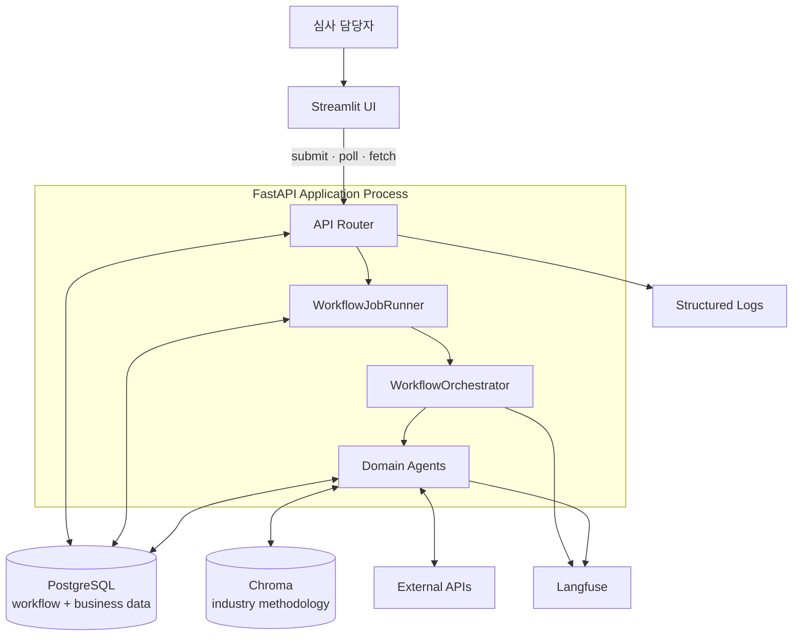

# 컴포넌트 설계서

## 1. 문서 개요

- 목적: 현재 구현된 FinAgent-SME 컴포넌트와 책임을 설명한다
- 원칙:
  - API는 얇게 유지한다
  - 오케스트레이터가 흐름을 제어한다
  - agent는 단일 책임에 가깝게 유지한다
  - 공통 메타데이터는 contract로 표준화한다

## 2. 상위 아키텍처


```mermaid
flowchart TB
    User[심사 담당자] --> UI[Streamlit UI]

    subgraph App[FastAPI Application Process]
        API[API Router]
        Runner[WorkflowJobRunner]
        ORCH[WorkflowOrchestrator]
        AGENTS[Domain Agents]
        API --> Runner
        Runner --> ORCH --> AGENTS
    end

    UI -->|submit · poll · fetch| API
    API <--> DATA[(PostgreSQL\nworkflow + business data)]
    Runner <--> DATA
    AGENTS <--> DATA
    AGENTS <--> VECTOR[(Chroma\nindustry methodology)]
    AGENTS <--> EXT[External APIs]
    API --> OBS[Structured Logs]
    ORCH --> LF[Langfuse]
    AGENTS --> LF
```

`WorkflowJobRunner`는 별도 배포 worker가 아니라 FastAPI lifespan에서 시작되는 단일 background loop입니다. API 프로세스가 중단되면 남아 있던 `queued`/`running` job은 다음 시작 시 `WORKER_RESTARTED`로 종료됩니다.

## 3. 컴포넌트 목록

| 계층 | 컴포넌트 | 책임 |
| --- | --- | --- |
| Presentation | Streamlit UI | 회사명 입력, 결과 렌더링 |
| API | FastAPI Router | 요청 검증, request_id 바인딩, HTTP 매핑 |
| Job | `WorkflowJobRunner` | queued job claim, timeout 적용, 결과/실패 저장 |
| Orchestration | `WorkflowOrchestrator` | 그래프 실행, 상태 계산, 응답 조립 |
| Agent | `CompanyResolverAgent` | 기업 식별 |
| Agent | `NewsCollectorAgent` | 뉴스 수집/요약/적재 |
| Agent | `FinancialAnalystAgent` | 재무 분석 |
| Agent | `IndustryAnalystAgent` | 산업/거시 분석 |
| Agent | `RiskEventAgent` | 이벤트 탐지 |
| Agent | `DecisionAgent` | 등급/판단/한도 산출 |
| Agent | `ReportAgent` | 보고서 생성 |
| Agent | `ValidationAgent` | 결과 검증과 score 기록 |
| Agent | `MultiModalDocumentAgent` | PDF 텍스트와 차트 이미지 추출 |
| Data | Repository / Service | DB 조회/저장, use-case 처리 |
| Retrieval | Chroma / Industry RAG | 산업 방법론 PDF 검색과 출처 제공 |
| Evaluation | RAGAS Evaluation | retriever/agent 품질 평가와 artifact 생성 |
| Observability | Logging / Langfuse | 요청 추적과 품질 score |

### 실제 모듈 구성

| 모듈 경로 | 구현 책임 |
| --- | --- |
| `backend/api/routes/workflows.py` | 동기/비동기 workflow HTTP endpoint |
| `backend/data/services/workflow_job_runner.py` | background job claim, 실행, timeout, 저장 |
| `backend/data/services/workflow_job_service.py` | job 생성/조회/결과 use-case |
| `backend/agents/orchestrator/graph.py` | LangGraph 노드, 의존 edge, validation gate 분기 |
| `backend/agents/orchestrator/step_runner.py` | agent 입력/출력 계약, timeout, retry |
| `backend/agents/orchestrator/results.py` | workflow 상태 계산과 차단 응답 조립 |
| `backend/agents/multimodal_document/agent.py` | 문서 처리 task 계획과 결과 계약 |
| `backend/agents/multimodal_document/processor.py` | PDF 텍스트/차트 이미지 추출 |
| `backend/agents/validation/agent.py` | 최종 결과 정합성 검사와 score 기록 |
| `backend/common/langfuse.py` | trace/observation/score client adapter |
| `backend/rag/evaluation.py` | retriever/agent RAGAS row, metric, report 생성 |
| `backend/scripts/regenerate_industry_rag_artifacts.py` | 고정 평가셋 artifact 일괄 재생성 |
| `backend/scripts/verify_langfuse_trace.py` | trace 전송, flush, API 재조회 증거 생성 |
| `frontend/views/report.py` | workflow 결과 보고서 렌더링 |

## 4. 오케스트레이터 설계

### 역할

- payload를 초기 context로 변환
- agent 프로토콜 검증
- LangGraph 노드/엣지 구성
- step 결과를 공통 형식으로 기록
- 최종 `context`와 `steps`를 반환

### 그래프 규칙

| 구분 | 노드 |
| --- | --- |
| Resolver | `company_resolver` |
| 시작 노드 | `news_collector`, `financial_analyst` |
| 의존 노드 | `risk_event`, `industry_analyst` |
| 후속 노드 | `decision`, `report`, `validation` |

Validation gate는 `report -> validation` 뒤에 조건부 edge를 둔다. 실패하면 기본
1회 `report`로 되돌아가 재생성/재검증하고, 재시도 소진 시 `END`로 이동하면서
`validation_gate_status=blocked`로 결과를 차단한다. 내부 payload의
`validation_retry_attempts`는 `0..3` 범위에서 재시도 횟수를 조절한다.

### 상태 계산

- `build_result()`가 최종 응답을 조립한다
- 기업 미존재 시 `not_target`
- 나머지는 `steps[*].ok` 집계로 `success/partial/failed`
- 재검증 통과 시 이전 validation 실패 step은 감사용으로 유지하되 상태 집계에서는 제외
- validation 차단 시 `status=failed`, `code=VALIDATION_FAILED`로 고정하고 최종
  decision/report 필드를 공개 context에서 제거

## 5. 주요 agent 설계

### `CompanyResolverAgent`

- 입력: `company_name`
- 의존성: `company_lookup` service
- 출력: `company_found`, `corp_code`, `corp_name`, `company_profile`

### `NewsCollectorAgent`

- 입력: 기업 식별 정보, 옵션성 수집 파라미터
- 의존성: `backend/tools/news.py`
- 출력: `news_result`, `news_data`, `news_tool_runs`, `news_tool_errors`

### `FinancialAnalystAgent`

- 입력: `corp_code`, 선택적 `target_year`
- 의존성: `FinancialDataProvider`
- 출력: `financial_statements`, `financial_ratios`, `financial_trend`, `grade_cap`

### `IndustryAnalystAgent`

- 입력: `corp_code`, `financial_ratios`
- 의존성: `IndustryDataProvider`
- 출력: `industry_summary`, `industry_outlook`, `business_cycle`, `macro_indicators`
- 방법론 근거: `industry_outlook.industry_methodology`, `industry_outlook.methodology_sources`

### `RiskEventAgent`

- 입력: `news_data`, `corp_code`, `company_name`
- 출력: `overall_risk_level`, 이벤트 카운트, 처리 오류 정보

### `DecisionAgent`

- 입력: 리스크/재무/산업 context
- 출력: `decision`, `credit_grade`, `credit_score`, `recommended_limit`, `explanation`

### `ReportAgent`

- 입력: 판단 결과와 explanation
- 출력: `report`
- 특이사항: explanation 부족 시 fallback summary/recommendation 생성

### `ValidationAgent`

- 입력: `decision`, `credit_grade`, `recommended_limit`, `report`
- 출력: `validation_result`
- 특이사항: 실패는 `status=failed`이며 orchestrator validation gate를 작동시킴
- Langfuse score는 활성화된 경우만 기록

## 6. 데이터 계층

| 계층 | 역할 |
| --- | --- |
| `backend/data/db.py` | DB URL 해석, 테이블명 상수 |
| `repositories/` | SQL 조회, DataFrame append/save |
| `services/` | 기업 조회, DART 파이프라인 orchestration |

업무 데이터와 job 상태는 PostgreSQL에, 산업 방법론 임베딩은 Chroma에 저장합니다. 두 저장소의 데이터 수명주기와 백업 정책은 분리해서 다룹니다.

## 7. 관측성

| 수단 | 위치 | 목적 |
| --- | --- | --- |
| 구조화 로깅 | API, orchestrator, agent | 운영 추적 |
| Langfuse trace | workflow root | 요청 단위 추적 |
| Langfuse observation | agent/tool | 세부 실행 가시성 |
| Langfuse score | validation | 품질 수치 기록 |
| `steps` | API 응답 | step 수준 디버깅 정보 제공 |

실제 적재 검증은 아래 명령으로 trace를 생성하고 flush한 뒤 Trace API에서 재조회한다.
성공 증거에는 credential 없이 trace ID와 URL만 기록된다.

```bash
.venv/bin/python -m backend.scripts.verify_langfuse_trace
```

## 8. 실행 구성

| 구성요소 | 현재 방식 |
| --- | --- |
| Backend + Job Runner | `.venv/bin/python -m uvicorn backend.main:app --reload --host 0.0.0.0 --port 8000` |
| Frontend | `.venv/bin/python -m streamlit run frontend/main.py --server.address 0.0.0.0 --server.port 8501` |
| DB | `backend/docker-compose.yml`의 PostgreSQL |
| DB Build | `scripts/setup-db.sh build` |
| RAG Ingest | `.venv/bin/python -m backend.rag.ingest_industry_docs` |
| RAGAS Artifact 재생성 | `.venv/bin/python -m backend.scripts.regenerate_industry_rag_artifacts` |

## 9. 현재 확장 포인트

- 공개 API body 확장 (`pdf_path`, `continue_on_error` 등)
- 추가 agent 노드 연결
- UI 업로드/진행상태 기능
- job runner의 별도 worker 프로세스/분산 queue 전환
