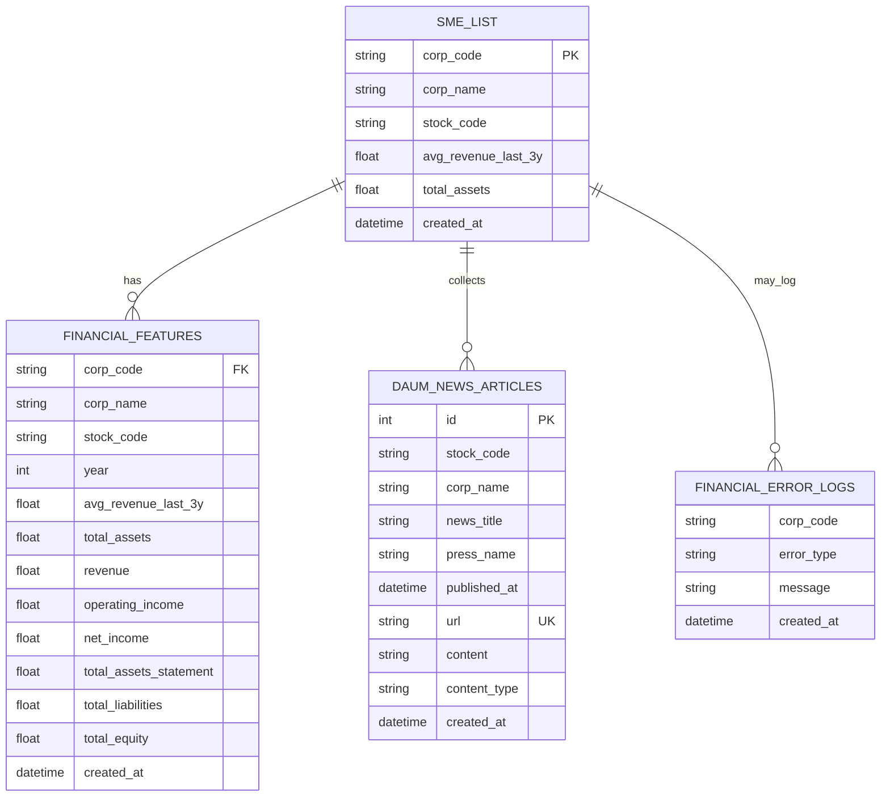

# ERD

## 1. 문서 개요

- 문서 목적: FinAgent-SME의 핵심 데이터 저장 구조를 테이블 단위로 설명한다.
- 기준 범위: 현재 코드에서 직접 참조하거나 생성하는 주요 PostgreSQL 테이블

## 2. 엔터티 관계도

## 3. 엔터티 상세 정의

### 3.1 `sme_list`

| 컬럼 | 타입 | 설명 |
| --- | --- | --- |
| `corp_code` | 문자열 | 기업 고유 코드, 실질 식별 키 |
| `corp_name` | 문자열 | 기업명 |
| `stock_code` | 문자열 | 종목코드 |
| `avg_revenue_last_3y` | 숫자 | 최근 3개년 평균 매출 |
| `total_assets` | 숫자 | 총자산 요약값 |
| `created_at` | 일시 | 적재 시각 |

역할:

- 기업 마스터
- `CompanyResolverAgent`의 검색 기준 테이블
- 뉴스 수집 대상 회사 목록 제공

### 3.2 `financial_features`

| 컬럼 | 타입 | 설명 |
| --- | --- | --- |
| `corp_code` | 문자열 | 기업 코드 |
| `corp_name` | 문자열 | 기업명 |
| `stock_code` | 문자열 | 종목코드 |
| `year` | 정수 | 사업연도 |
| `avg_revenue_last_3y` | 숫자 | 최근 3개년 평균 매출 |
| `total_assets` | 숫자 | 총자산 요약값 |
| `revenue` | 숫자 | 매출액 |
| `operating_income` | 숫자 | 영업이익 |
| `net_income` | 숫자 | 당기순이익 |
| `total_assets_statement` | 숫자 | 재무제표상 자산총계 |
| `total_liabilities` | 숫자 | 부채총계 |
| `total_equity` | 숫자 | 자본총계 |
| `created_at` | 일시 | 적재 시각 |

역할:

- 재무 분석 Agent의 입력 원천
- 리스크 이벤트의 재무 이상 탐지 원천
- 연도별 재무 비교 및 추세 계산 기반

복합 식별 성격:

- `corp_code + stock_code + year`

### 3.3 `daum_news_articles`

| 컬럼 | 타입 | 설명 |
| --- | --- | --- |
| `id` | 정수 | PK |
| `stock_code` | 문자열 | 종목코드 |
| `corp_name` | 문자열 | 기업명 |
| `news_title` | 문자열 | 기사 제목 |
| `press_name` | 문자열 | 언론사명 |
| `published_at` | 일시 | 기사 발행 시각 |
| `url` | 문자열 | 기사 URL |
| `content` | 문자열 | 기사 본문 또는 요약 |
| `content_type` | 문자열 | `full_text` 또는 `summary` |
| `created_at` | 일시 | 적재 시각 |

유니크 제약:

- `stock_code + url`

역할:

- 뉴스 적재 이력 관리
- downstream 리스크 분석용 뉴스 컨텍스트 생성 기반

### 3.4 `financial_error_logs`

| 컬럼 | 타입 | 설명 |
| --- | --- | --- |
| `corp_code` | 문자열 | 오류 발생 기업 코드 |
| `error_type` | 문자열 | 오류 유형 |
| `message` | 문자열 | 오류 메시지 |
| `created_at` | 일시 | 기록 시각 |

역할:

- 배치 파이프라인 실패 이력 보관
- 재수집/운영 모니터링 기준

## 4. 논리 관계 설명

| From | To | 관계 | 설명 |
| --- | --- | --- | --- |
| `sme_list` | `financial_features` | 1:N | 한 기업은 여러 연도 재무 피처를 가진다 |
| `sme_list` | `daum_news_articles` | 1:N | 한 기업은 여러 뉴스 기사와 연결된다 |
| `sme_list` | `financial_error_logs` | 1:N | 한 기업은 여러 배치 오류 로그를 가질 수 있다 |

## 5. 사용 시나리오별 테이블 접근

| 시나리오 | 읽기/쓰기 테이블 |
| --- | --- |
| 기업 검색/대상 판별 | `sme_list` 읽기 |
| 재무 분석 | `financial_features` 읽기 |
| 뉴스 수집 | `sme_list` 읽기, `daum_news_articles` 쓰기 |
| 리스크 분석 | `daum_news_articles` 간접 활용, `financial_features` 읽기 |
| 데이터 구축 배치 | `sme_list`, `financial_features`, `financial_error_logs` 쓰기 |

## 6. 설계 메모

- 현재 구현은 FK 제약을 코드 레벨 관계로 관리하며, DB 스키마 강제 FK는 명시돼 있지 않다.
- `corp_code`가 시스템 전반의 핵심 비즈니스 식별자다.
- 향후 평가/감사 요구가 커지면 `workflow_runs`, `agent_runs`, `evaluation_scores` 같은 운영 테이블 확장이 유효하다.
