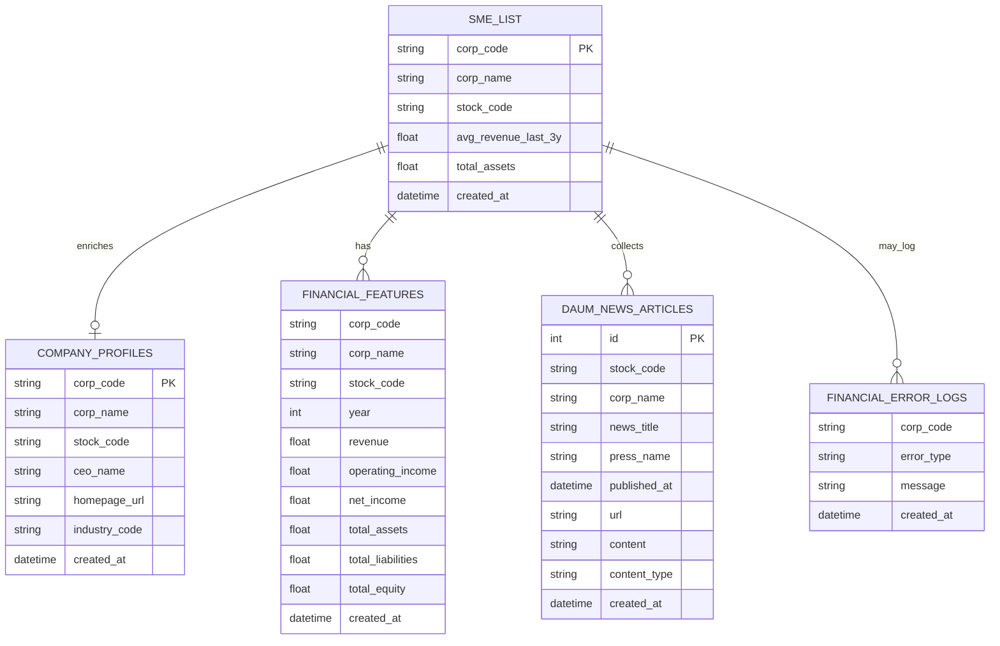

# ERD

## 1. 문서 개요

- 목적: 현재 코드가 직접 읽거나 쓰는 핵심 테이블을 설명한다
- 범위: PostgreSQL 기준 논리 모델

## 2. 엔터티 관계도

## 3. 테이블 설명

### `sme_list`

- 기업 마스터
- `CompanyResolverAgent`의 기본 조회 대상
- 뉴스 수집 대상 기업 목록의 기준

핵심 컬럼:

- `corp_code`
- `corp_name`
- `stock_code`
- `avg_revenue_last_3y`
- `total_assets`
- `created_at`

### `company_profiles`

- 기업개황 보강 테이블
- `sme_list`와 같은 `corp_code`를 기준으로 최신 개황 정보를 병합

대표 컬럼:

- `corp_code`
- `corp_name`
- `stock_code`
- `ceo_name`
- `address`
- `homepage_url`
- `ir_url`
- `phone_number`
- `industry_code`
- `created_at`

### `financial_features`

- 재무 분석용 연도별 피처 저장소
- `FinancialAnalystAgent`와 일부 리스크 분석에서 사용

대표 키 성격:

- `corp_code + stock_code + year`

### `daum_news_articles`

- 뉴스 수집 적재 테이블
- ORM 모델에서 `(stock_code, url)` 유니크 제약을 사용

대표 컬럼:

- `stock_code`
- `corp_name`
- `news_title`
- `press_name`
- `published_at`
- `url`
- `content`
- `content_type`
- `created_at`

### `financial_error_logs`

- DB 구축 파이프라인 실패 이력 저장

키 성격:

- `corp_code + error_type + message`

## 4. 논리 관계

| From | To | 관계 | 설명 |
| --- | --- | --- | --- |
| `sme_list` | `company_profiles` | 1:0..1 | 기업개황 보강 |
| `sme_list` | `financial_features` | 1:N | 연도별 재무 피처 |
| `sme_list` | `daum_news_articles` | 1:N | 수집된 뉴스 기사 |
| `sme_list` | `financial_error_logs` | 1:N | 배치 오류 로그 |

## 5. 사용 시나리오

| 시나리오 | 읽기/쓰기 |
| --- | --- |
| 대상 기업 판별 | `sme_list` 읽기, `company_profiles` 읽기 |
| 재무 분석 | `financial_features` 읽기 |
| 뉴스 수집 | `sme_list` 읽기, `daum_news_articles` 쓰기 |
| DB 구축 | `sme_list`, `company_profiles`, `financial_features`, `financial_error_logs` 쓰기 |

## 6. 설계 메모

- 일부 키/제약은 코드 레벨에서 관리된다
- 신규 컬럼은 저장 시 nullable TEXT 컬럼으로 자동 추가될 수 있다
- 향후 운영성 테이블(`workflow_runs`, `agent_runs`)은 아직 도입되지 않았다
