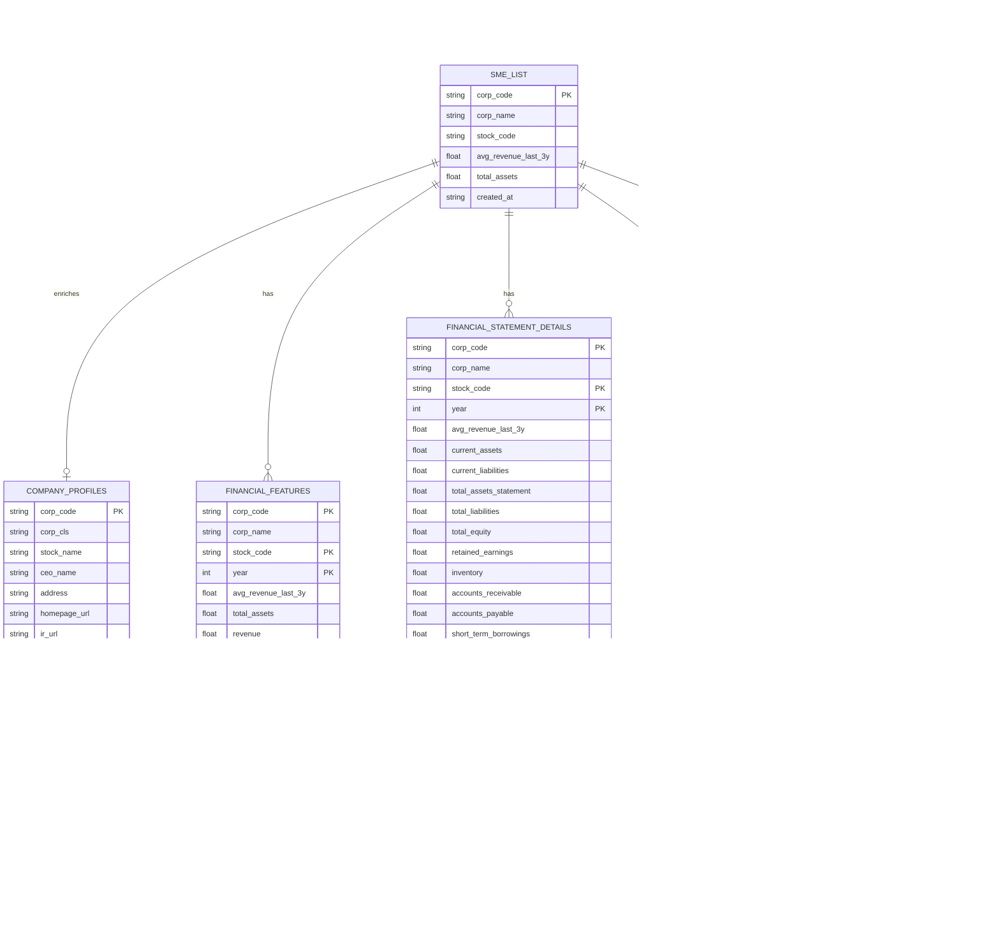
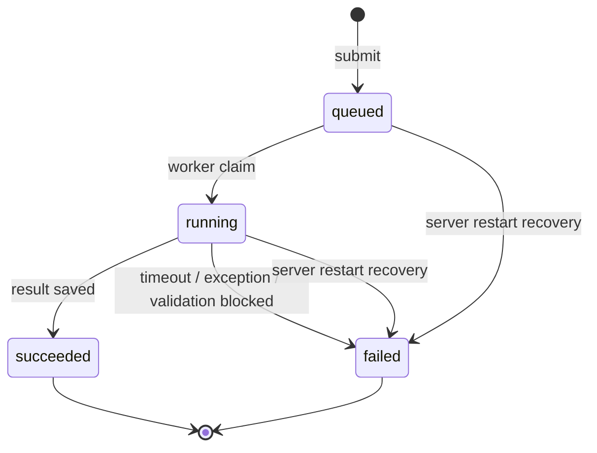

# ERD

## 1. 문서 개요

- 목적: 현재 코드가 직접 읽거나 쓰는 핵심 테이블을 설명한다
- 범위: PostgreSQL 기준 논리 모델

## 2. 엔터티 관계도

```mermaid
erDiagram
    SME_LIST ||--o| COMPANY_PROFILES : enriches
    SME_LIST ||--o{ FINANCIAL_FEATURES : has
    SME_LIST ||--o{ FINANCIAL_STATEMENT_DETAILS : has
    SME_LIST ||--o{ DAUM_NEWS_ARTICLES : collects
    SME_LIST ||--o{ FINANCIAL_ERROR_LOGS : may_log

    SME_LIST {
        string corp_code PK
        string corp_name
        string stock_code
        float avg_revenue_last_3y
        float total_assets
        string created_at
    }

    COMPANY_PROFILES {
        string corp_code PK
        string corp_cls
        string stock_name
        string ceo_name
        string address
        string homepage_url
        string ir_url
        string phone_number
        string fax_number
        string industry_code
        string established_date
        string settlement_month
        string created_at
    }

    FINANCIAL_FEATURES {
        string corp_code PK
        string corp_name
        string stock_code PK
        int year PK
        float avg_revenue_last_3y
        float total_assets
        float revenue
        float operating_income
        float net_income
        float total_assets_statement
        float total_liabilities
        float total_equity
        string created_at
    }

    FINANCIAL_STATEMENT_DETAILS {
        string corp_code PK
        string corp_name
        string stock_code PK
        int year PK
        float avg_revenue_last_3y
        float current_assets
        float current_liabilities
        float total_assets_statement
        float total_liabilities
        float total_equity
        float retained_earnings
        float inventory
        float accounts_receivable
        float accounts_payable
        float short_term_borrowings
        float current_portion_long_term_borrowings
        float long_term_borrowings
        float bonds
        float tangible_assets
        float revenue
        float cost_of_goods_sold
        float operating_income
        float net_income
        float interest_expense
        float operating_cashflow
        float capital_expenditure
        string audit_opinion
        boolean is_external_audit
        string created_at
    }

    DAUM_NEWS_ARTICLES {
        int id PK
        string stock_code UK
        string corp_name
        string news_title
        string press_name
        datetime published_at
        string url UK
        string content
        string content_type
        datetime created_at
    }

    FINANCIAL_ERROR_LOGS {
        string error_datetime
        string corp_code PK
        string corp_name
        string error_type PK
        string message PK
        text response
        text traceback
    }

    WORKFLOW_JOBS {
        string job_id PK
        string request_id
        string company_name
        string status
        text result_json
        text step_summary_json
        string error_code
        string error_message
        string submitted_at
        string started_at
        string finished_at
        string updated_at
    }
```

`workflow_jobs`는 기업 master와 외래키로 묶이지 않는 실행 이력입니다. 입력 당시 회사명과 추적 ID를 보존하고, 성공한 workflow payload를 JSON 문자열로 저장합니다. 시간 값은 ISO 8601 문자열을 PostgreSQL `TEXT` 컬럼에 기록합니다.

Mermaid의 `DAUM_NEWS_ARTICLES.stock_code`, `url`에 표시한 `UK`는 두 컬럼을
합친 복합 유니크 제약 `uq_daum_news_stock_code_url`을 뜻합니다. DataFrame 기반
테이블의 `created_at`은 현재 `YYYY-MM-DD` 문자열로 적재됩니다.

`financial_features`, `financial_statement_details`, `financial_error_logs`의 복수
`PK` 표시는 repository upsert에 사용하는 논리적 복합 키입니다. DataFrame으로
생성되는 PostgreSQL 테이블에 물리적 `PRIMARY KEY` 제약을 추가한다는 뜻은 아닙니다.

## 3. 테이블 설명

### `sme_list`

- 기업 마스터
- `CompanyResolverAgent`의 기본 조회 대상
- 뉴스 수집 대상 기업 목록의 기준

핵심 컬럼:

- `corp_code`
- `corp_name`
- `stock_code`
- `avg_revenue_last_3y`
- `total_assets`
- `created_at`

### `company_profiles`

- 기업개황 보강 테이블
- `sme_list`와 같은 `corp_code`를 기준으로 최신 개황 정보를 병합

대표 컬럼:

- `corp_code`
- `corp_cls`
- `stock_name`
- `ceo_name`
- `address`
- `homepage_url`
- `ir_url`
- `phone_number`
- `fax_number`
- `industry_code`
- `established_date`
- `settlement_month`
- `created_at`

`stock_code`는 현재 `company_profiles` DataFrame 저장 컬럼이 아니며, 조회 결과의
기업 프로필에는 `sme_list.stock_code`가 병합되어 제공된다.

### `financial_features`

- 재무 분석용 연도별 피처 저장소
- `FinancialAnalystAgent`와 일부 리스크 분석에서 사용

대표 키 성격:

- `corp_code + stock_code + year`

대표 컬럼:

- `avg_revenue_last_3y`
- `total_assets`
- `revenue`
- `operating_income`
- `net_income`
- `total_assets_statement`
- `total_liabilities`
- `total_equity`
- `created_at`

`total_assets`는 SME 대상 판별에 사용한 기업 개요 자산총액이고,
`total_assets_statement`는 재무제표 계정에서 추출한 자산총계다.

### `financial_statement_details`

- 심사 지표 계산용 연도별 상세 재무 스냅샷
- `FinancialDataProvider`가 이 테이블을 우선 사용하고 `financial_features`를 보조 데이터로 사용

키 성격:

- `corp_code + stock_code + year`

대표 컬럼:

- `avg_revenue_last_3y`
- `current_assets`, `current_liabilities`
- `total_assets_statement`, `total_liabilities`, `total_equity`
- `retained_earnings`, `inventory`, `accounts_receivable`, `accounts_payable`
- `short_term_borrowings`, `current_portion_long_term_borrowings`, `long_term_borrowings`, `bonds`
- `tangible_assets`, `revenue`, `cost_of_goods_sold`, `operating_income`, `net_income`
- `interest_expense`, `operating_cashflow`, `capital_expenditure`
- `audit_opinion`, `is_external_audit`, `created_at`

### `daum_news_articles`

- 뉴스 수집 적재 테이블
- ORM 모델에서 `(stock_code, url)` 유니크 제약을 사용

대표 컬럼:

- `stock_code`
- `corp_name`
- `news_title`
- `press_name`
- `published_at`
- `url`
- `content`
- `content_type`
- `created_at`

### `financial_error_logs`

- DB 구축 파이프라인 실패 이력 저장

대표 컬럼:

- `error_datetime`
- `corp_code`
- `corp_name`
- `error_type`
- `message`
- `response`, `traceback` (오류 유형에 따라 동적으로 추가)

키 성격:

- `corp_code + error_type + message`

### `workflow_jobs`

- 비동기 심사 job의 queue와 결과 저장소
- repository가 최초 접근 시 `CREATE TABLE IF NOT EXISTS`로 생성
- `job_id`가 기본 키이며 `request_id`로 로그·Langfuse trace와 연결
- `result_json`, `step_summary_json`은 성공 완료 시 기록
- validation gate 차단은 `failed / VALIDATION_FAILED`로 기록하며 결과 JSON은 저장하지 않음
- 서버 재시작 시 미완료 job은 `failed / WORKER_RESTARTED`로 전이

상태 전이:

```mermaid
stateDiagram-v2
    [*] --> queued: submit
    queued --> running: worker claim
    running --> succeeded: result saved
    running --> failed: timeout / exception / validation blocked
    queued --> failed: server restart recovery
    running --> failed: server restart recovery
    succeeded --> [*]
    failed --> [*]
```

## 4. 논리 관계

| From | To | 관계 | 설명 |
| --- | --- | --- | --- |
| `sme_list` | `company_profiles` | 1:0..1 | 기업개황 보강 |
| `sme_list` | `financial_features` | 1:N | 연도별 재무 피처 |
| `sme_list` | `financial_statement_details` | 1:N | 연도별 상세 재무 스냅샷 |
| `sme_list` | `daum_news_articles` | 1:N | 수집된 뉴스 기사 |
| `sme_list` | `financial_error_logs` | 1:N | 배치 오류 로그 |

`workflow_jobs`와 업무 테이블 사이에는 현재 물리적 외래키가 없습니다.

## 5. 사용 시나리오

| 시나리오 | 읽기/쓰기 |
| --- | --- |
| 대상 기업 판별 | `sme_list` 읽기, `company_profiles` 읽기 |
| 재무 분석 | `financial_statement_details` 우선 읽기, `financial_features` 보조 읽기 |
| 뉴스 수집 | `sme_list` 읽기, `daum_news_articles` 쓰기 |
| DB 구축 | `sme_list`, `company_profiles`, `financial_features`, `financial_statement_details`, `financial_error_logs` 쓰기 |
| 비동기 심사 | `workflow_jobs` 생성, claim, 상태/결과 갱신 |

## 6. 설계 메모

- `sme_list`, `company_profiles`와 재무/오류 테이블의 논리 키는 repository 코드가
  upsert와 중복 제거에 사용하며 물리적 PK 제약은 보장하지 않는다
- DataFrame 기반 5개 테이블은 최초 `to_sql()` 시 DataFrame dtype으로 생성되며,
  이후 신규 컬럼은 nullable `TEXT`로 자동 추가될 수 있다
- `workflow_jobs`는 현재 운영 queue와 실행 결과를 함께 보관한다
- agent별 정규화 실행 테이블(`agent_runs`)은 아직 도입되지 않았다
- 산업 방법론 벡터는 PostgreSQL이 아니라 `backend/vectorstore/industry_knowledge/`의 Chroma에 저장된다
