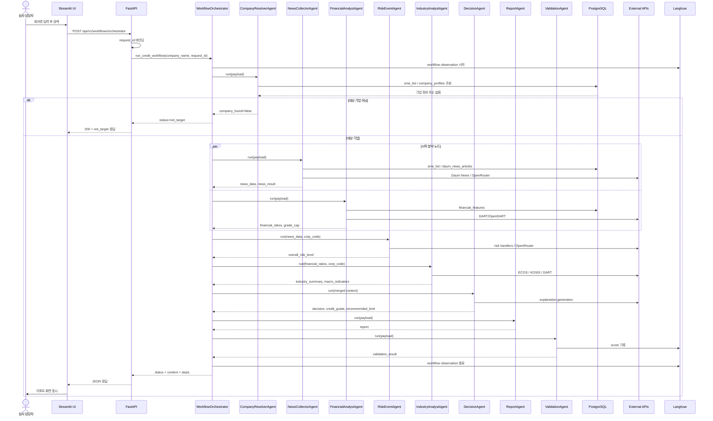
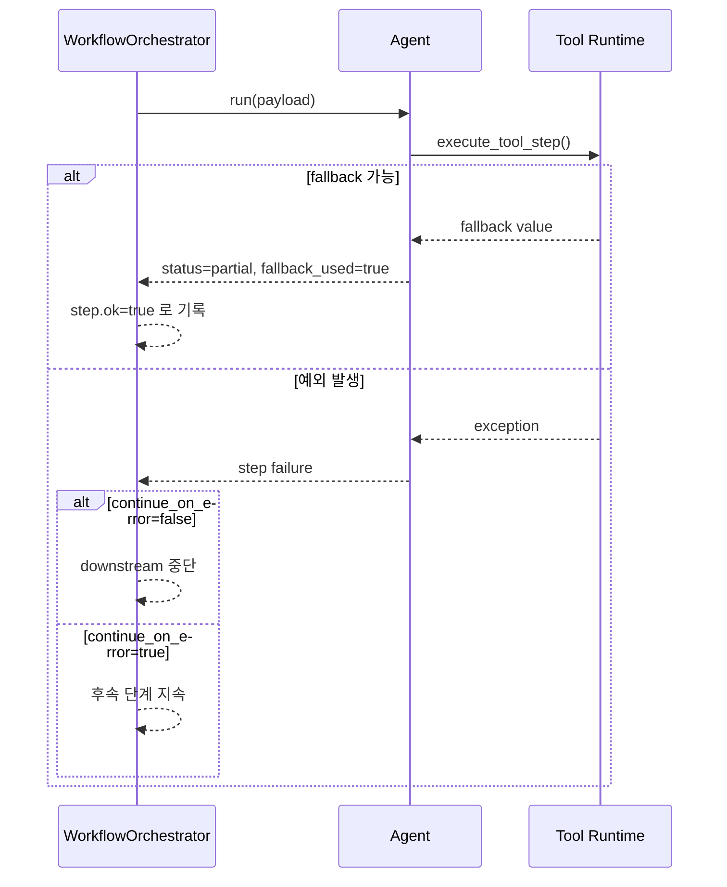
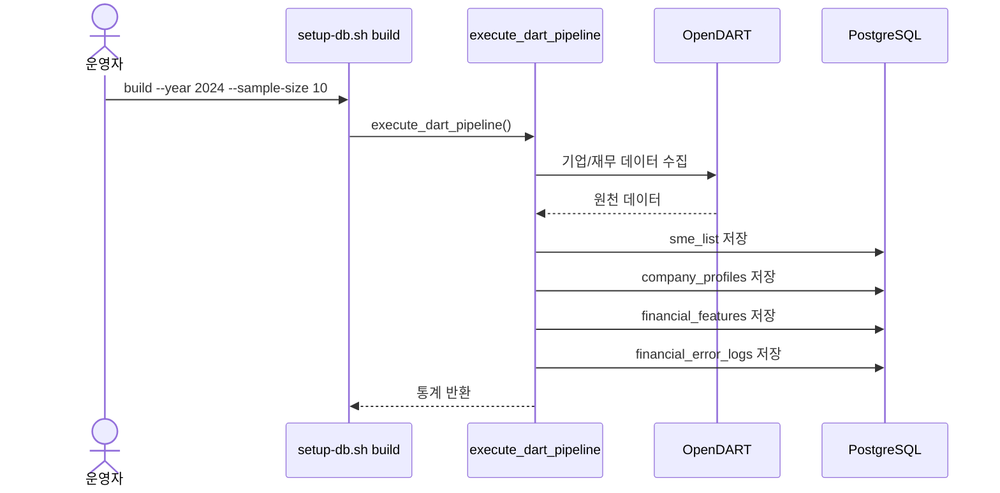

# 시퀀스 다이어그램

## 1. 실시간 심사 워크플로우

```mermaid
sequenceDiagram
    actor User as 심사 담당자
    participant UI as Streamlit UI
    participant API as FastAPI
    participant ORCH as WorkflowOrchestrator
    participant RES as CompanyResolverAgent
    participant NEWS as NewsCollectorAgent
    participant FIN as FinancialAnalystAgent
    participant RISK as RiskEventAgent
    participant IND as IndustryAnalystAgent
    participant DEC as DecisionAgent
    participant REP as ReportAgent
    participant VAL as ValidationAgent
    participant DB as PostgreSQL
    participant EXT as External APIs
    participant LF as Langfuse

    User->>UI: 회사명 입력 후 검색
    UI->>API: POST /api/v1/workflows/orchestrator
    API->>API: request_id 바인딩
    API->>ORCH: run_credit_workflow(company_name, request_id)
    ORCH->>LF: workflow observation 시작

    ORCH->>RES: run(payload)
    RES->>DB: sme_list / company_profiles 조회
    DB-->>RES: 기업 정보 또는 없음

    alt 대상 기업 아님
        RES-->>ORCH: company_found=false
        ORCH-->>API: status=not_target
        API-->>UI: 200 + not_target 응답
    else 대상 기업
        par 시작 분석 노드
            ORCH->>NEWS: run(payload)
            NEWS->>DB: sme_list / daum_news_articles
            NEWS->>EXT: Daum News / OpenRouter
            NEWS-->>ORCH: news_data, news_result
        and
            ORCH->>FIN: run(payload)
            FIN->>DB: financial_features
            FIN->>EXT: DART/OpenDART
            FIN-->>ORCH: financial_ratios, grade_cap
        end

        ORCH->>RISK: run(news_data, corp_code)
        RISK->>EXT: risk handlers / OpenRouter
        RISK-->>ORCH: overall_risk_level

        ORCH->>IND: run(financial_ratios, corp_code)
        IND->>EXT: ECOS / KOSIS / DART
        IND-->>ORCH: industry_summary, macro_indicators

        ORCH->>DEC: run(merged context)
        DEC->>EXT: explanation generation
        DEC-->>ORCH: decision, credit_grade, recommended_limit

        ORCH->>REP: run(payload)
        REP-->>ORCH: report

        ORCH->>VAL: run(payload)
        VAL->>LF: score 기록
        VAL-->>ORCH: validation_result

        ORCH->>LF: workflow observation 종료
        ORCH-->>API: status + context + steps
        API-->>UI: JSON 응답
        UI->>User: 리포트 화면 표시
    end
```

## 2. fallback / 실패 처리

```mermaid
sequenceDiagram
    participant ORCH as WorkflowOrchestrator
    participant AG as Agent
    participant TOOL as Tool Runtime

    ORCH->>AG: run(payload)
    AG->>TOOL: execute_tool_step()

    alt fallback 가능
        TOOL-->>AG: fallback value
        AG-->>ORCH: status=partial, fallback_used=true
        ORCH-->>ORCH: step.ok=true 로 기록
    else 예외 발생
        TOOL-->>AG: exception
        AG-->>ORCH: step failure
        alt continue_on_error=false
            ORCH-->>ORCH: downstream 중단
        else continue_on_error=true
            ORCH-->>ORCH: 후속 단계 지속
        end
    end
```

## 3. DB 구축 배치

```mermaid
sequenceDiagram
    actor Operator as 운영자
    participant CLI as setup-db.sh build
    participant SVC as execute_dart_pipeline
    participant DART as OpenDART
    participant DB as PostgreSQL

    Operator->>CLI: build --year 2024 --sample-size 10
    CLI->>SVC: execute_dart_pipeline()
    SVC->>DART: 기업/재무 데이터 수집
    DART-->>SVC: 원천 데이터
    SVC->>DB: sme_list 저장
    SVC->>DB: company_profiles 저장
    SVC->>DB: financial_features 저장
    SVC->>DB: financial_error_logs 저장
    SVC-->>CLI: 통계 반환
```
