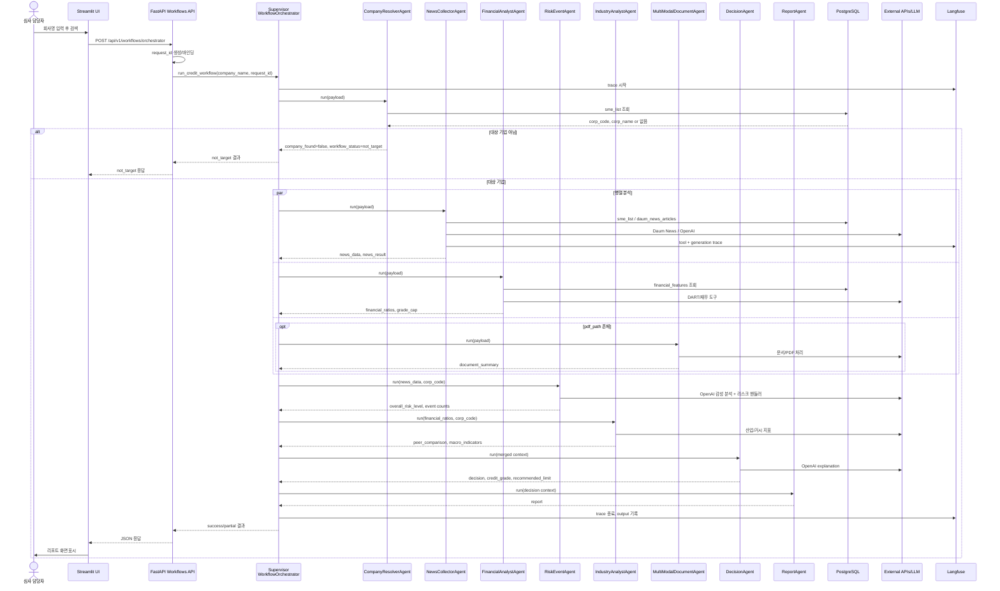
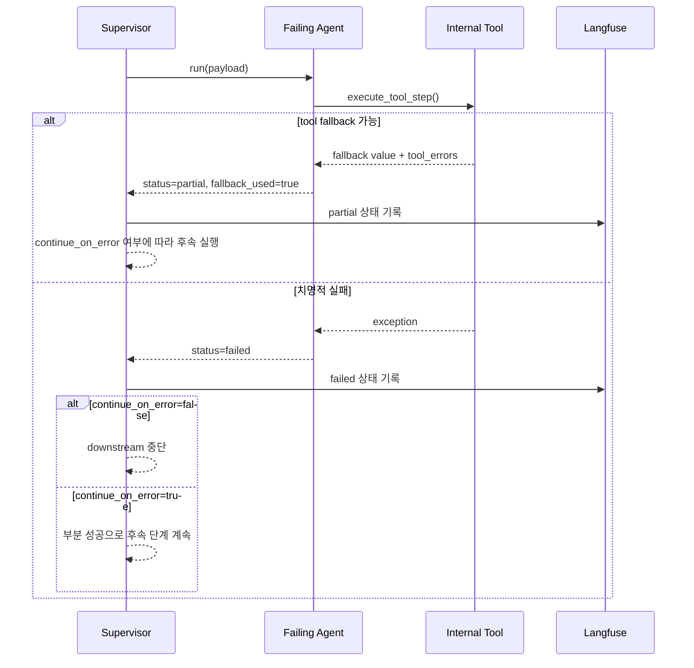
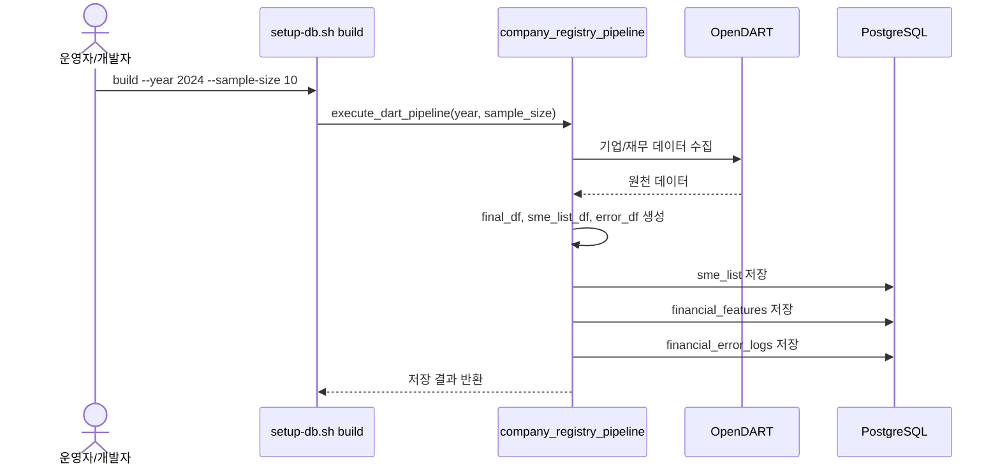

# 시퀀스 다이어그램

## 1. 문서 개요

- 문서 목적: FinAgent-SME 심사 요청의 주요 호출 순서를 시각적으로 설명한다.
- 표기 기준: `Supervisor = WorkflowOrchestrator`, `Sub-Agent = 개별 Agent`

## 2. 실시간 심사 워크플로우 시퀀스

## 3. 장애 대응 시퀀스

## 4. 배치 데이터 구축 시퀀스

