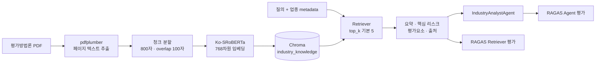
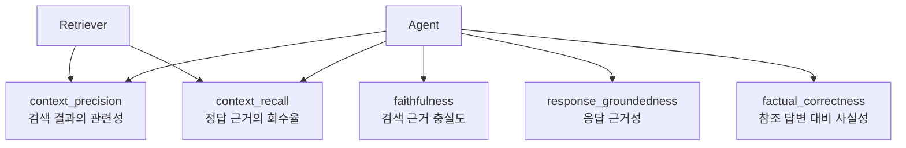

# 산업 신용평가방법론 RAG

## 목적

산업별 신용평가방법론 PDF를 검색 가능한 근거로 만들고, `IndustryAnalystAgent`가 산업 리스크와 평가요소를 출처와 함께 사용할 수 있도록 합니다. 검색 품질과 agent 응답 품질은 같은 평가 파이프라인에서 각각 측정합니다.

## 전체 파이프라인



## 구성 요소

| 경로 | 책임 |
| --- | --- |
| `backend/rag_docs/industry_methodology/` | 원본 PDF |
| `backend/rag/ingest_industry_docs.py` | 파일명 metadata 파싱, 텍스트 추출, 청크 적재와 중복 방지 |
| `backend/rag/chroma_client.py` | 영구 Chroma client와 한국어 임베딩 함수 |
| `backend/rag/retriever.py` | metadata filter, 의미 검색, 요약과 출처 조립 |
| `backend/rag/evaluation.py` | JSONL 검증, 평가 row 생성, RAGAS 실행과 집계 |
| `backend/scripts/evaluate_industry_rag.py` | retriever/agent 평가 CLI |
| `backend/rag/eval_datasets/` | 평가 데이터셋 |

벡터 데이터는 기본적으로 `backend/vectorstore/industry_knowledge/`에 영구 저장됩니다. 컬렉션 이름은 `industry_knowledge`, 임베딩 모델은 `jhgan/ko-sroberta-multitask`입니다.

## 1. 문서 적재

프로젝트 루트에서 실행합니다.

```bash
.venv/bin/python -m backend.rag.ingest_industry_docs
```

적재기는 결정론적 청크 ID를 사용하므로 같은 문서를 다시 실행하면 기존 청크를 건너뜁니다. 결과 로그의 주요 카운터는 다음과 같습니다.

| 카운터 | 의미 |
| --- | --- |
| `documents` | 처리한 PDF 수 |
| `chunks` | 생성한 전체 청크 수 |
| `inserted` | 새로 저장한 청크 수 |
| `skipped` | 이미 존재해 건너뛴 청크 수 |
| `errors` | 파일 단위 처리 실패 수 |

> 최초 실행은 sentence-transformers 모델 다운로드가 필요할 수 있습니다. 운영 환경에서는 모델 캐시와 네트워크 정책을 미리 확인해야 합니다.

## 2. 검색 계약

`retrieve_industry_methodology()`는 `query`, `industry_name`, `ksic_code`, `sub_sector`를 조합하고 기본 `top_k=5`로 검색합니다.

```text
industry_methodology
├── industry_name
├── summary
├── key_risk_factors[]
├── credit_assessment_factors[]
├── source_count
├── unavailable
└── error
methodology_sources[]
└── 문서명·페이지·업종 metadata·거리
```

평가처럼 원문 context가 필요한 호출은 `include_contexts=True`를 사용하며 `retrieved_contexts[]`가 추가됩니다. 검색 인프라 오류나 결과 없음은 예외 대신 `unavailable=true` payload로 정규화되어 agent fallback을 허용합니다.

## 3. 평가 데이터셋

JSONL은 한 줄에 하나의 JSON 객체를 둡니다. 알 수 없는 필드는 Pydantic 검증에서 거부됩니다.

### Retriever target

필수 필드: `case_id`, `user_input`, `reference`

선택 필드: `industry_name`, `ksic_code`, `sub_sector`, `top_k`, `tags`

데이터셋: `backend/rag/eval_datasets/industry_methodology.jsonl`

### Agent target

필수 필드: `case_id`, `user_input`, `reference`, `company_name`, `corp_code`

선택 필드: `ksic_code`, `induty_code`, `sub_sector`, `financial_ratios`, `target_year`, `tags`

데이터셋: `backend/rag/eval_datasets/industry_agent.jsonl`

실제 기업의 민감정보를 평가셋이나 리포트에 넣지 않습니다. 테스트용 식별자와 합성 재무비율을 사용합니다.

## 4. RAGAS 실행

Retriever 품질:

```bash
.venv/bin/python -m backend.scripts.evaluate_industry_rag \
  backend/rag/eval_datasets/industry_methodology.jsonl \
  --target retriever \
  --output-path backend/rag/artifacts/industry_rag_eval/report.json
```

IndustryAnalystAgent end-to-end 품질:

```bash
.venv/bin/python -m backend.scripts.evaluate_industry_rag \
  backend/rag/eval_datasets/industry_agent.jsonl \
  --target agent \
  --output-path backend/rag/artifacts/industry_rag_eval/agent_report.json
```

`--model`로 evaluator 모델을 덮어쓸 수 있습니다. 지정하지 않으면 프로젝트 LLM 설정을 사용하므로 `backend/.env`의 `OPEN_ROUTER_API_KEY`와 모델 설정이 필요합니다. Agent 평가는 실제 provider 경로에 따라 DB 또는 외부 연동도 요구할 수 있습니다.

## 5. 메트릭 읽기



리포트는 케이스별 점수와 metric 평균을 JSON으로 저장합니다. `unavailable` 또는 `error`가 있는 row는 인프라/데이터 문제와 품질 문제를 구분해 먼저 확인합니다. 현재 CLI는 품질 임계값으로 종료 코드를 바꾸지 않으므로, CI gate를 도입할 때는 합의한 metric별 기준을 별도로 적용해야 합니다.

## 6. 검증

```bash
.venv/bin/pytest -o cache_dir=.cache/pytest \
  tests/unit/test_chroma_client.py \
  tests/unit/test_industry_rag_ingest.py \
  tests/unit/test_industry_rag_retriever.py \
  tests/unit/test_industry_rag_evaluation.py \
  tests/unit/test_evaluate_industry_rag_script.py
```

## 7. Hybrid Search(BM25+Dense) 도입 검토

정량 검증을 위해 BM25+Dense 하이브리드 검색을 구현하고 골든셋 9개 케이스로
Dense 단독과 Hit@k/MRR을 비교했습니다.

### 측정 결과

| 지표 | Dense | Hybrid | 변화 |
| --- | --- | --- | --- |
| Hit@3 | 0.8889 | 0.7778 | -0.1111 |
| MRR@3 | 0.8148 | 0.5370 | -0.2778 |
| Hit@5 | 0.8889 | 0.8889 | 0.0000 |
| MRR@5 | 0.8148 | 0.5593 | -0.2555 |

### 원인 분석

RRF 점수 계산 구조상 k 파라미터를 조정해도 Dense·BM25 점수 비율이 유지되어 효과가
없습니다. 근본 원인은 쿼리가 구어체 자연어("알려줘", "정리해줘")로 작성되어 있어
BM25 토큰이 gold chunk의 전문용어와 매칭되지 않는 것입니다. 가중치를 Dense 2배로
설정해도 MRR@3이 0.537로 정체하여 Dense 단독(0.815) 대비 낮습니다.

### 결론 및 현황

본 도메인에서는 LLM이 생성한 구어체 쿼리가 주를 이루므로 Dense 단독이 더 적합합니다.
Hybrid 코드는 `retrieve_industry_methodology(use_hybrid=True)`로 호출해 재활성화할
수 있도록 보존하며 기본값은 `False`(Dense 단독)입니다. 키워드 기반 정확 질의
비중이 늘면 재검토합니다.

### 재현

```bash
/opt/anaconda3/bin/python -m backend.rag.retrieval_metrics
```

결과는 `backend/rag/artifacts/retrieval_metrics_YYYYMMDD_HHMMSS.json`에 저장됩니다.

고정 retriever/agent 평가셋의 RAGAS artifact를 함께 재생성하려면 다음 명령을 사용합니다.

```bash
.venv/bin/python -m backend.scripts.regenerate_industry_rag_artifacts
```

기본 출력은 `backend/rag/artifacts/industry_rag_eval/report.json`과
`backend/rag/artifacts/industry_rag_eval/agent_report.json`입니다.

## 운영 체크리스트

- 원본 PDF의 라이선스와 보관 정책을 확인합니다.
- 새 파일명이 지원 업종 mapping에 맞는지 확인합니다.
- 재적재 후 `inserted`, `skipped`, `errors`를 기록합니다.
- 평가 리포트와 모델명을 함께 보관해 실행 간 비교 가능성을 유지합니다.
- 벡터 저장소와 평가 artifact에 민감정보가 포함되지 않도록 검토합니다.
